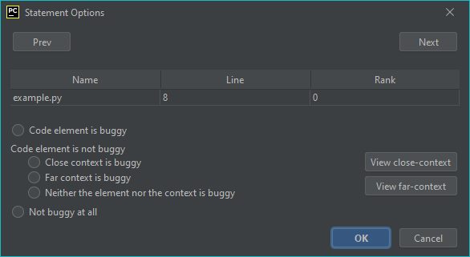

#Statement Options

###How to open the *Statement Options* window?

First, run CharmFl and go to the Statement tab in the results table.
Now select a row, by left-clicking the Name (e.g. *example.py*), then use right-click in the same column to open the
*Statement Options* window.

###Functions
- By pressing the *Prev* or *Next* button you can switch between statements.
- You can change the state of your code with the fallowing options:

  - Code element is buggy 
  - Close context is buggy 
  - Far context is buggy 
  - Neither the element nor the context is buggy 
  - Not buggy at all

- *View close-context* will navigate you to the line of the chosen file shown in the table.
- *View far-context*...

